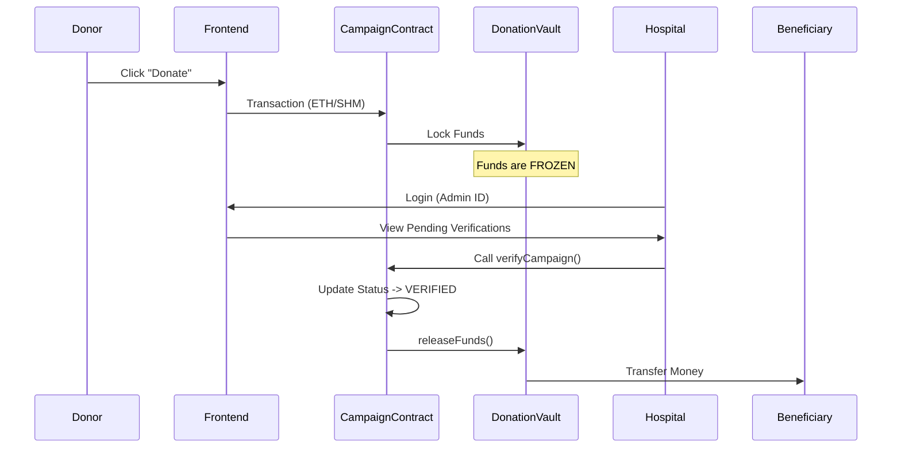

# ❤️ HeartChain: Decentralized Medical Crowdfunding Platform

**HeartChain** is a transparent, blockchain-powered crowdfunding platform designed to revolutionize medical fundraising. By leveraging the **Shardeum EVM Testnet**, we ensure that every donation is traceable, secure, and reaches the intended beneficiary only after rigorous verification by trusted hospitals.

---

##  Deployed Smart Contracts (Shardeum EVM Testnet)

The core logic of HeartChain is immutable and deployed on the **Shardeum Sphinx/Liberty Testnet**.

| Contract Name | Address | Description |
| :--- | :--- | :--- |
| **DonationVault** | `0x5557DA0c3869bdFcf1cdbb52EE14264D94393240` | Secure Escrow Vault. Holds funds safely until verification. |
| **CampaignContract** | `0x870f8E55acE020f0340c960c17E3C45CeDB5a59c` | State Machine. Manages campaign lifecycles (Active, Goal Reached, Verified). |
| **BadgeContract** | `0x1299Ce591486fC1CD30cDa8e9dBCCc01232DA218` | NFT Rewards. Issues soulbound tokens/badges to donors for their impact. |

> **Status**: `DonationVault` is successfully linked to `CampaignContract`, establishing the Trustless Escrow architecture.

---

## 🛠️ Technology Stack & Installation Guide

We have structured the project into three distinct layers. Here is exactly what we use and how to run it.

### 1. Frontend (User Interface)
The frontend is the window to our application, designed for ease of use and visual appeal.

*   **Next.js 14 (React Framework)**: Used for server-side rendering and static site generation, ensuring fast load times and SEO optimization.
*   **TailwindCSS**: A utility-first CSS framework that allows us to build a modern, "Glassmorphism" inspired medical design system rapidly.
*   **Ethers.js**: A lightweight library to connect the frontend to the Shardeum Blockchain and interacting with users' MetaMask wallets.

#### **Frontend Setup**
**Requirements**: Node.js v18+

1.  Navigate to the directory:
    ```bash
    cd frontend
    ```
2.  Install all dependencies:
    ```bash
    npm install
    ```
3.  **Environment Variables**: Create a `.env.local` file in the `frontend` folder:
    ```env
    # Points to your running backend
    NEXT_PUBLIC_API_URL=http://localhost:8000
    ```
4.  Run the development server:
    ```bash
    npm run dev
    ```
    > The app will open at `http://localhost:3000`

---

### 2.  Backend (API & Logic)
The backend manages off-chain data (images, descriptions), authenticates hospital admins, and serves as a bridge for complex queries.

*   **FastAPI (Python)**: A high-performance web framework for building APIs. We use it for its speed and automatic documentation features.

*   **PyJWT & Passlib**: Used for secure "Stateless" authentication of Hospital Admins and handling password hashing.

#### **Backend Setup**
**Requirements**: Python 3.9+, MongoDB installed locally.

1.  Navigate to the directory:
    ```bash
    cd backend-maddy
    ```
2.  **Create Virtual Environment** (Recommended):
    ```bash
    # Windows
    python -m venv venv
    .\venv\Scripts\activate

    # Mac/Linux
    python3 -m venv venv
    source venv/bin/activate
    ```
3.  Install dependencies:
    ```bash
    pip install -r requirements.txt
    ```
4.  **Environment Variables**: Create a `.env` file in `backend-maddy`:
    ```env
    MONGODB_URL=mongodb://localhost:27017
    DB_NAME=heartchain_db
    ADMIN_PASSWORD=secret_admin_123
    
    # Optional: For future blockchain writing features
    SHARDEUM_RPC_URL=https://api-mezame.shardeum.org/
    ADMIN_PRIVATE_KEY=your_private_key_here
    ```
5.  Run the server:
    ```bash
    uvicorn main:app --reload
    ```
    > API Documentation available at `http://localhost:8000/docs`

---

### 3.  Blockchain (Smart Contracts)
The trust layer. This code runs on the Shardeum global computer, not our servers.

*   **Solidity (v0.8.x)**: The programming language for writing the smart contracts (Campaign, Vault, Badges).
*   **Hardhat**: A development environment to compile, deploy, and test our smart contracts.
*   **Shardeum EVM**: The specific blockchain network we deployed to. It offers low gas fees and linear scalability.

#### **Blockchain Interaction**
*   **No local setup required** for the blockchain if you use our deployed addresses.
*   **MetaMask**: Ensure you have the [Shardeum Sphinx Testnet](https://docs.shardeum.org/network/endpoints) added to your browser wallet.
*   **Connect**: Clicking "Connect Wallet" on the frontend will automatically prompt MetaMask.

---

##  Key Features Logic (Detailed)

### 1. **Trustless Funds Management (Escrow)**
*   **Problem**: In traditional platforms, funds are held by the platform or sent directly to users before treatment.
*   **Solution**: HeartChain uses a **DonationVault**. Funds are locked on-chain and **cannot** be withdrawn by the campaign creator.
*   **Release Mechanism**: Funds are ONLY released after a **Partner Hospital** digitally verifies the medical case.

### 2. **Hospital Verification System**
*   **Binding**: Campaigns are cryptographically linked to a `hospitalId` (e.g., `890123` for Apollo Mumbai) at the moment of creation.
*   **Admin Dashboard**: Hospital Admins login via secure ID. The system filters campaigns to show ONLY those assigned to them that are **Fully Funded**.
*   **Verification**: The Admin acts as a "Human Oracle", certifying the patient is admitted. This triggers the smart contract to unlock funds.
*   *See [HOSPITAL_VERIFICATION_README.md](./HOSPITAL_VERIFICATION_README.md) for the manual.*

### 3. **Gamified Donor Engagement (NFT Badges)**
*   Donors earn unique **NFT Badges** based on their contribution history.
*   **Bronze Heart**: First donation.
*   **Silver Savior**: >$500 total contributions.
*   **Gold Guardian**: Top 5% of donors.
*   These are Soulbound Tokens (SBTs), meaning they cannot be sold, acting as a permanent reputation score.

---

##  Smart Contract Architecture (Deep Dive)

The security model relies on the **Separation of Concerns** principle:

1.  **DonationVault (`0x5557...`)**:
    *   **Role**: The Safe.
    *   **Logic**: It has a `releaseFunds` function that can ONLY be called by the `CampaignContract`. It rejects calls from anyone else (even the Admin).

2.  **CampaignContract (`0x870f...`)**:
    *   **Role**: The Brain.
    *   **Logic**: Tracks the state (`Active` -> `GoalReached` -> `Verified`). It only calls the Vault to release funds if the state is `Verified`.
    *   **Access Control**: Only the whitelisted `hospitalWallet` can toggle the state to `Verified`.

3.  **BadgeContract (`0x1299...`)**:
    *   **Role**: The Rewarder.
    *   **Logic**: A standard ERC-721 contract that mints tokens to donor addresses upon successful donation events.

---

---

## Project Structure

Key files and directories you should know about:

```
HeartChain/
├── blockchain/                 # Smart Contract Development
│   ├── contracts/
│   │   ├── Campaign.sol        # Logic for individual campaigns
│   │   ├── DonationVault.sol   # Secure Escrow Vault logic
│   │   └── Badge.sol           # NFT Badge logic
│   └── hardhat.config.js       # Deployment configuration
│
├── backend-maddy/              # Python FastAPI Backend
│   ├── main.py                 # Application entry point
│   ├── core/                   # Config and Security logic
│   ├── routes/                 # API Endpoints (Campaigns, Hosp. Auth)
│   ├── models/                 # Pydantic Data Models
│   └── .env                    # Secrets (DB URL, Admin Keys)
│
└── frontend/                   # Next.js User Interface
    ├── app/                    # Pages (Create, Dashboard, Profile)
    ├── components/             # UI Components (Navbar, Cards)
    ├── lib/                    # API Clients & Utilities
    │   └── api.ts              # Connects Frontend to Backend
    └── public/                 # Static assets (images)
```

---

##  System Workflow

The following flow illustrates how money moves through HeartChain:



---

##  API Reference (Backend)

The backend provides REST endpoints for off-chain data management.

| Method | Endpoint | Description |
| :--- | :--- | :--- |
| `POST` | `/campaigns/individual` | Create a new medical campaign. |
| `POST` | `/hospital/login` | Authenticate a Hospital Admin. |
| `GET` | `/campaigns/{id}` | Fetch campaign details (images, story). |
| `POST` | `/documents/upload` | Upload medical proofs (stored securely). |

---

##  Troubleshooting

**1. MetaMask not popping up?**
*   Ensure you have the browser extension installed.
*   Refresh the page.
*   Check if you are on the **Shardeum Sphinx Testnet**.

**2. "Hospital ID Verification Failed"?**
*   Ensure you are using the correct credentials from the table above.
*   Example: ID `890123` for Apollo Mumbai.

**3. Backend not starting?**
*   Check if MongoDB is running (`net start MongoDB` on Windows).
*   Ensure `requirements.txt` is installed in your virtual environment.

---

## 🌍 Impact Summary
HeartChain removes the middleman and the uncertainty from medical crowdfunding. By enforcing hospital-side verification through smart contracts, we ensure that **100% of the funds go to genuine treatments**, building a trust layer that Web2 platforms cannot match.
